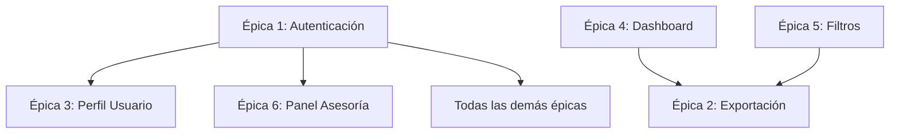

# Proceso de Diseño de Software - BudgetBuddy
## Basado en Historias de Usuario del Equipo

---

## 1. Análisis y Comprensión de Requisitos

### 1.1 Mapeo de Épicas y Funcionalidades Core

El equipo ha identificado **6 épicas principales** que definen el alcance del sistema:

| Épica | Funcionalidad Principal | Complejidad | Prioridad |
|-------|------------------------|-------------|-----------|
| **Épica 1** | Sistema de Roles y Autenticación | Alta | Crítica |
| **Épica 2** | Exportación de Reportes | Media | Alta |
| **Épica 3** | Perfil de Usuario | Baja | Media |
| **Épica 4** | Dashboard y Estadísticas | Media-Alta | Alta |
| **Épica 5** | Filtros y Búsqueda | Media | Alta |
| **Épica 6** | Panel de Asesoría | Media-Alta | Alta |

### 1.2 Identificación de Dependencias Técnicas



**Orden de Desarrollo Sugerido:**
1. **Épica 1** (Autenticación) - Base fundamental
2. **Épicas 3, 4, 5** (Perfil, Dashboard, Filtros) - Desarrollo paralelo
3. **Épicas 2, 6** (Exportación, Asesoría) - Funcionalidades avanzadas

---

## 2. Arquitectura del Sistema

### 2.1 Arquitectura Frontend (Cliente)

```
┌─────────────────────────────────────────┐
│               FRONTEND                   │
├─────────────────────────────────────────┤
│  Capa de Presentación (UI Components)   │
│  ├── Auth Components                     │
│  ├── Dashboard Components               │
│  ├── Report Components                  │
│  ├── Profile Components                 │
│  └── Advisor Components                 │
├─────────────────────────────────────────┤
│  Capa de Lógica de Negocio             │
│  ├── Auth Service                       │
│  ├── Transaction Service                │
│  ├── Report Service                     │
│  ├── User Service                       │
│  └── Advisor Service                    │
├─────────────────────────────────────────┤
│  Capa de Gestión de Estado             │
│  ├── Auth State Management              │
│  ├── User Context                       │
│  └── Transaction Context                │
├─────────────────────────────────────────┤
│  Capa de Comunicación                  │
│  ├── HTTP Client (Axios)                │
│  ├── Token Management                   │
│  └── API Endpoints                      │
└─────────────────────────────────────────┘
```

### 2.2 Arquitectura Backend (Servidor)

```
┌─────────────────────────────────────────┐
│               BACKEND                    │
├─────────────────────────────────────────┤
│  Capa de Controladores                 │
│  ├── AuthController                     │
│  ├── UserController                     │
│  ├── TransactionController              │
│  └── AdvisorController                  │
├─────────────────────────────────────────┤
│  Capa de Servicios                     │
│  ├── AuthService (JWT)                  │
│  ├── UserService                        │
│  ├── TransactionService                 │
│  └── AdvisorService                     │
├─────────────────────────────────────────┤
│  Capa de Middleware                    │
│  ├── Authentication Middleware          │
│  ├── Authorization Middleware           │
│  ├── CORS Middleware                    │
│  └── Rate Limiting                      │
├─────────────────────────────────────────┤
│  Capa de Acceso a Datos               │
│  ├── User Repository                    │
│  ├── Transaction Repository             │
│  └── Advisory Repository                │
├─────────────────────────────────────────┤
│  Base de Datos                         │
│  └── PostgreSQL/MySQL                   │
└─────────────────────────────────────────┘
```

---

## 3. Diseño de Base de Datos

### 3.1 Modelo Entidad-Relación

```sql
-- Tabla Users (Épica 1)
CREATE TABLE users (
    id UUID PRIMARY KEY DEFAULT gen_random_uuid(),
    name VARCHAR(100) NOT NULL,
    email VARCHAR(255) UNIQUE NOT NULL,
    password_hash VARCHAR(255) NOT NULL,
    role ENUM('USER', 'ADVISOR') NOT NULL DEFAULT 'USER',
    biography TEXT,
    created_at TIMESTAMP DEFAULT CURRENT_TIMESTAMP,
    updated_at TIMESTAMP DEFAULT CURRENT_TIMESTAMP
);

-- Tabla Transactions (Épicas 4, 5)
CREATE TABLE transactions (
    id UUID PRIMARY KEY DEFAULT gen_random_uuid(),
    user_id UUID NOT NULL REFERENCES users(id),
    description VARCHAR(255) NOT NULL,
    amount DECIMAL(12,2) NOT NULL,
    category VARCHAR(50) NOT NULL,
    type ENUM('INCOME', 'EXPENSE') NOT NULL,
    is_public BOOLEAN DEFAULT FALSE,
    transaction_date DATE NOT NULL,
    created_at TIMESTAMP DEFAULT CURRENT_TIMESTAMP
);

-- Tabla Advisories (Épica 6)
CREATE TABLE advisories (
    id UUID PRIMARY KEY DEFAULT gen_random_uuid(),
    advisor_id UUID NOT NULL REFERENCES users(id),
    user_id UUID NOT NULL REFERENCES users(id),
    category VARCHAR(50) NOT NULL,
    content TEXT NOT NULL,
    created_at TIMESTAMP DEFAULT CURRENT_TIMESTAMP
);

-- Tabla Refresh Tokens (Épica 1)
CREATE TABLE refresh_tokens (
    id UUID PRIMARY KEY DEFAULT gen_random_uuid(),
    user_id UUID NOT NULL REFERENCES users(id),
    token VARCHAR(500) NOT NULL UNIQUE,
    expires_at TIMESTAMP NOT NULL,
    created_at TIMESTAMP DEFAULT CURRENT_TIMESTAMP
);
```

### 3.2 Índices para Optimización

```sql
-- Índices para mejorar rendimiento según las HU
CREATE INDEX idx_transactions_user_id ON transactions(user_id);
CREATE INDEX idx_transactions_date ON transactions(transaction_date);
CREATE INDEX idx_transactions_category ON transactions(category);
CREATE INDEX idx_transactions_public ON transactions(is_public);
CREATE INDEX idx_advisories_advisor_id ON advisories(advisor_id);
CREATE INDEX idx_advisories_user_id ON advisories(user_id);
```

---

## 4. Diseño de APIs REST

### 4.1 Endpoints de Autenticación (Épica 1)

```javascript
// Rutas de autenticación
POST   /api/auth/register     // HU1 - Registro Usuario
POST   /api/auth/login        // HU4 - Login con JWT
POST   /api/auth/refresh      // HU4 - Renovar token
POST   /api/auth/logout       // HU4 - Cerrar sesión
GET    /api/auth/me           // HU3 - Obtener perfil actual
```

### 4.2 Endpoints de Usuario (Épica 3)

```javascript
// Gestión de perfil
GET    /api/users/profile     // HU1 - Ver perfil
PUT    /api/users/profile     // HU2 - Editar perfil
```

### 4.3 Endpoints de Transacciones (Épicas 4, 5)

```javascript
// CRUD de transacciones
GET    /api/transactions              // HU1,2,3,4,5,6 (Épica 5)
POST   /api/transactions              // Crear transacción
PUT    /api/transactions/:id          // Actualizar transacción
DELETE /api/transactions/:id          // Eliminar transacción

// Estadísticas y reportes
GET    /api/transactions/stats        // HU1,2,3 (Épica 4)
GET    /api/transactions/export       // Épica 2
GET    /api/transactions/public       // Para asesores (Épica 6)
```

### 4.4 Endpoints de Asesoría (Épica 6)

```javascript
// Panel de asesor
GET    /api/advisories               // HU1,3 - Ver asesorías
POST   /api/advisories               // HU4 - Crear asesoría
PUT    /api/advisories/:id           // HU4 - Editar asesoría
GET    /api/advisories/metrics       // HU1 - Métricas del asesor
GET    /api/users/public-transactions // HU2 - Usuarios con transacciones públicas
```

---

## 5. Planificación del Desarrollo por Sprints

### 5.1 Sprint 1: Fundamentos (Semana 1)
**Responsables:** Paola (Épica 1), María (Épica 3)

#### Tareas Técnicas:
- **Configuración del Entorno:**
  - Setup del repositorio y estructura de carpetas
  - Configuración de ESLint, Prettier, y herramientas de desarrollo
  - Setup de base de datos y migraciones iniciales

- **Épica 1 - Autenticación (Paola):**
  - Implementar middleware de autenticación JWT
  - Crear endpoints de registro y login
  - Implementar sistema de refresh tokens
  - Crear guardas de ruta y middleware de autorización
  - Insertar asesores pre-registrados mediante script SQL

- **Épica 3 - Perfil Usuario (María):**
  - Diseñar componente de visualización de perfil
  - Implementar formulario de edición de perfil
  - Conectar con localStorage para persistencia temporal

#### Criterios de Finalización Sprint 1:
- ✅ Usuario puede registrarse como USER
- ✅ Asesores pueden autenticarse con credenciales pre-registradas
- ✅ Sistema de tokens JWT funcional
- ✅ Diferenciación de UI según rol
- ✅ Perfil de usuario visualizable y editable

---

### 5.2 Sprint 2: Funcionalidades Core (Semana 2)
**Responsables:** Marisol (Épica 4), Elmer (Épica 5)

#### Tareas Técnicas:
- **Épica 4 - Dashboard y Estadísticas (Marisol):**
  - Implementar Chart.js para gráficos interactivos
  - Crear componente de gráfico de tendencia de gastos (6 meses)
  - Desarrollar gráfico circular de distribución por categorías
  - Calcular y mostrar indicadores de gasto promedio
  - Optimizar consultas para cálculos en tiempo real

- **Épica 5 - Filtros y Búsqueda (Elmer):**
  - Implementar calendario de rango de fechas
  - Crear filtros por monto (min/max) con validaciones
  - Desarrollar selector múltiple de categorías
  - Implementar búsqueda en tiempo real con autocompletado
  - Crear sistema de ordenamiento flexible
  - Agregar resaltado de términos en resultados

#### Criterios de Finalización Sprint 2:
- ✅ Dashboard muestra gráficos interactivos
- ✅ Filtros múltiples funcionan simultáneamente
- ✅ Búsqueda en tiempo real operativa
- ✅ Ordenamiento flexible implementado
- ✅ Responsive en dispositivos móviles

---

### 5.3 Sprint 3: Funcionalidades Avanzadas (Semana 3)
**Responsables:** Carlos (Épica 2), Karen (Épica 6)

#### Tareas Técnicas:
- **Épica 2 - Exportación de Reportes (Carlos):**
  - Integrar librería ExcelJS para exportación Excel
  - Implementar jsPDF para generación de PDFs
  - Crear plantillas profesionales con estilos
  - Agregar validación de datos antes de exportar
  - Optimizar rendimiento para grandes volúmenes de datos

- **Épica 6 - Panel de Asesoría (Karen):**
  - Crear dashboard de métricas para asesores
  - Implementar visualización de transacciones públicas
  - Desarrollar sistema de categorización de asesorías
  - Crear filtros para historial de asesorías
  - Implementar análisis automático de patrones financieros
  - Agregar tooltips y mejoras de usabilidad

#### Criterios de Finalización Sprint 3:
- ✅ Exportación Excel/PDF funcional
- ✅ Panel de asesor completamente operativo
- ✅ Sistema de categorización implementado
- ✅ Métricas de asesor calculándose automáticamente
- ✅ Análisis de transacciones públicas funcional

---

## 6. Stack Tecnológico Definido

### 6.1 Frontend
```json
{
  "framework": "Vanilla JavaScript / React (según preferencia del equipo)",
  "styling": "CSS3 + Responsive Design",
  "charts": "Chart.js",
  "export": "ExcelJS + jsPDF",
  "http": "Fetch API / Axios",
  "bundler": "Webpack / Vite"
}
```

### 6.2 Backend
```json
{
  "runtime": "Node.js",
  "framework": "Express.js",
  "authentication": "JWT (jsonwebtoken)",
  "database": "PostgreSQL / MySQL",
  "orm": "Sequelize / Prisma (opcional)",
  "validation": "Joi / Express-validator",
  "security": "bcryptjs, helmet, cors"
}
```

---

## 7. Patrones de Diseño Aplicados

### 7.1 Patrón MVC (Model-View-Controller)
- **Model:** Entidades de base de datos y lógica de negocio
- **View:** Componentes de interfaz de usuario
- **Controller:** Endpoints de API y manejo de requests

### 7.2 Patrón Repository
```javascript
// Ejemplo de implementación
class TransactionRepository {
    async findByUserId(userId, filters = {}) {
        // Lógica de consulta con filtros (Épica 5)
    }
    
    async getStatistics(userId, dateRange) {
        // Cálculos para dashboard (Épica 4)
    }
    
    async findPublicTransactions() {
        // Para panel de asesoría (Épica 6)
    }
}
```

### 7.3 Patrón Service Layer
```javascript
// Separación de lógica de negocio
class AuthService {
    async registerUser(userData) {
        // HU1 - Registro con validaciones
    }
    
    async generateTokens(user) {
        // HU4 - JWT + Refresh token
    }
}
```

---

## 8. Plan de Testing

### 8.1 Pruebas Unitarias
- **Servicios de autenticación:** Validar JWT, refresh tokens
- **Cálculos de estadísticas:** Verificar métricas del dashboard
- **Filtros y búsquedas:** Probar combinaciones de filtros
- **Exportación:** Validar formatos Excel y PDF

### 8.2 Pruebas de Integración
- **Flujo de registro/login completo**
- **Creación y filtrado de transacciones**
- **Proceso de asesoría de extremo a extremo**
- **Exportación de reportes con datos reales**

### 8.3 Pruebas de UI/UX
- **Responsive design en móviles y desktop**
- **Estados de carga y feedback visual**
- **Usabilidad del panel de asesor**
- **Accesibilidad básica (WCAG)**

---

## 9. Consideraciones de Seguridad

### 9.1 Autenticación y Autorización
```javascript
// Middleware de seguridad
const authenticateToken = (req, res, next) => {
    // Validar JWT en headers
};

const authorizeRole = (roles) => (req, res, next) => {
    // Verificar rol del usuario
};
```

### 9.2 Validación de Datos
```javascript
// Esquemas de validación
const transactionSchema = {
    amount: Joi.number().positive().required(),
    category: Joi.string().valid(...validCategories),
    type: Joi.string().valid('INCOME', 'EXPENSE')
};
```

### 9.3 Protección de Datos Sensibles
- Hash de contraseñas con bcrypt
- Sanitización de inputs del usuario
- Rate limiting en endpoints críticos
- Validación de archivos de exportación

---

## 10. Métricas de Calidad y Definition of Done

### 10.1 Criterios de Aceptación Técnica
- ✅ **Funcionalidad:** Todos los criterios de HU cumplidos
- ✅ **Performance:** Tiempo de carga < 3 segundos
- ✅ **Seguridad:** Sin vulnerabilidades críticas
- ✅ **Usabilidad:** Responsive y accesible
- ✅ **Código:** Sin errores en consola, código documentado

### 10.2 Métricas de Éxito por Épica

| Épica | Métrica de Éxito | Objetivo |
|-------|------------------|----------|
| **Épica 1** | Autenticación exitosa | > 95% |
| **Épica 2** | Exportación sin errores | 100% |
| **Épica 3** | Perfil actualizable | 100% |
| **Épica 4** | Gráficos cargando | < 2 seg |
| **Épica 5** | Filtros responsivos | < 1 seg |
| **Épica 6** | Asesorías creadas | 100% |

---

## 11. Cronograma de Entregables

### 11.1 Hitos del Proyecto

```gantt
title Cronograma BudgetBuddy
dateFormat  YYYY-MM-DD
section Sprint 1
Autenticación JWT    :done, auth, 2025-11-06, 7d
Perfil Usuario       :done, profile, 2025-11-06, 7d
section Sprint 2  
Dashboard Stats      :active, dashboard, 2025-11-13, 7d
Filtros Avanzados    :active, filters, 2025-11-13, 7d
section Sprint 3
Exportación Reportes :export, 2025-11-20, 7d
Panel Asesoría      :advisory, 2025-11-20, 7d
section Entrega
Testing Final       :testing, 2025-11-27, 3d
Deployment         :deploy, 2025-11-30, 2d
```

### 11.2 Entregables por Sprint

**Sprint 1 (Nov 6-12):**
- Sistema de autenticación completo
- Perfil de usuario funcional
- Base de datos configurada

**Sprint 2 (Nov 13-19):**
- Dashboard con gráficos interactivos
- Sistema de filtros y búsqueda avanzada
- API de transacciones optimizada

**Sprint 3 (Nov 20-26):**
- Exportación Excel/PDF operativa
- Panel de asesoría completamente funcional
- Todas las funcionalidades integradas

**Entrega Final (Nov 27-30):**
- Testing completo y corrección de bugs
- Documentación técnica actualizada
- Deployment y presentación final

---

## 12. Riesgos y Mitigaciones

### 12.1 Riesgos Técnicos Identificados

| Riesgo | Probabilidad | Impacto | Mitigación |
|--------|--------------|---------|------------|
| **Complejidad JWT** | Media | Alto | Usar librería probada, testing extensivo |
| **Performance de gráficos** | Baja | Medio | Optimizar queries, lazy loading |
| **Exportación de archivos grandes** | Media | Medio | Paginación, procesamiento asíncrono |
| **Responsive en móviles** | Baja | Alto | Testing continuo en dispositivos |

### 12.2 Plan de Contingencia
- **Fallback para gráficos:** Tablas estáticas si Chart.js falla
- **Exportación alternativa:** CSV si Excel/PDF presenta problemas
- **Autenticación de respaldo:** Sistema básico de sesiones

---

## 13. Conclusión del Diseño

Este documento establece las bases técnicas y metodológicas para el desarrollo de BudgetBuddy, asegurando que:

1. **Cada historia de usuario** tiene un mapeo claro a componentes técnicos
2. **La arquitectura** soporta todos los requerimientos identificados
3. **El equipo** tiene claridad sobre responsabilidades y cronograma
4. **Los riesgos** están identificados y mitigados
5. **La calidad** está garantizada mediante criterios claros

**El equipo está listo para iniciar el desarrollo con confianza y claridad en los objetivos.**

---

*Documento generado el 6 de noviembre de 2025*  
*Basado en 22 historias de usuario distribuidas en 6 épicas*  
*Equipo: Paola, Carlos, María, Marisol, Elmer, Karen*